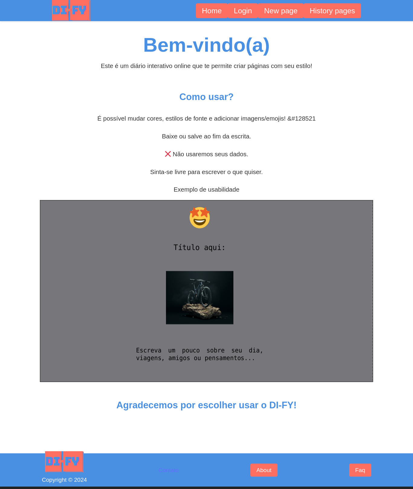

# DiarioInterativo
O DI-FY é um website para criação de páginas de diário, permitindo que os nossos usuários tenham a disponibilidade de baixar ou salvar suas páginas.

## Screenshot


# Funcionalidades
```bash
    Criação de conta: realize seu cadastro para garantir acesso a diferentes funcionalidades.
    Estilo da página: modifique os estilos, adicionando cores, emojis e imagens.
    Salve ou envie suas páginas: salvamento de suas páginas online.
    Baixe suas páginas: salve a página por impressão ou formato PDF.
```

# Stack
- Frontend:

        HTML + CSS3 + JavaScript
        React
        Vite

## Instalação e Uso
1. Acesse no navegador:

    https://di-fy.vercel.app/

2. Ou garanta que estejam instaladas as seguintes ferramentas:

        npm
        IDE (de sua preferência)
    
3. E siga os seguintes passos para rodar localmente:

        git clone https://github.com/Louiexz/DiarioInterativo.git

        cd di-fy

        npm install

        npm start

# Autores e contribuições
Autor e Desenvolvedor do site - [@Louiexz](https://github.com/Louiexz)

Contribuições são bem-vindas! Sinta-se à vontade para abrir issues ou pull requests.